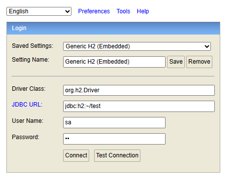
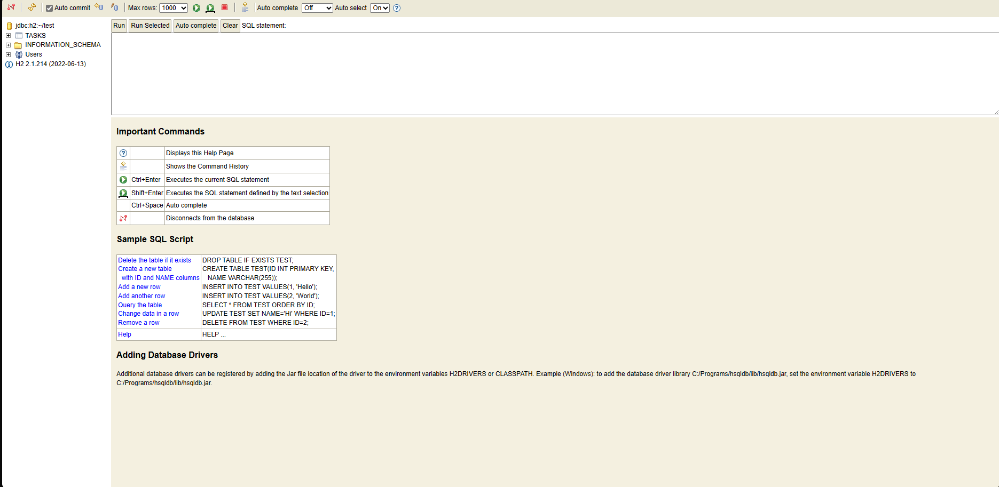
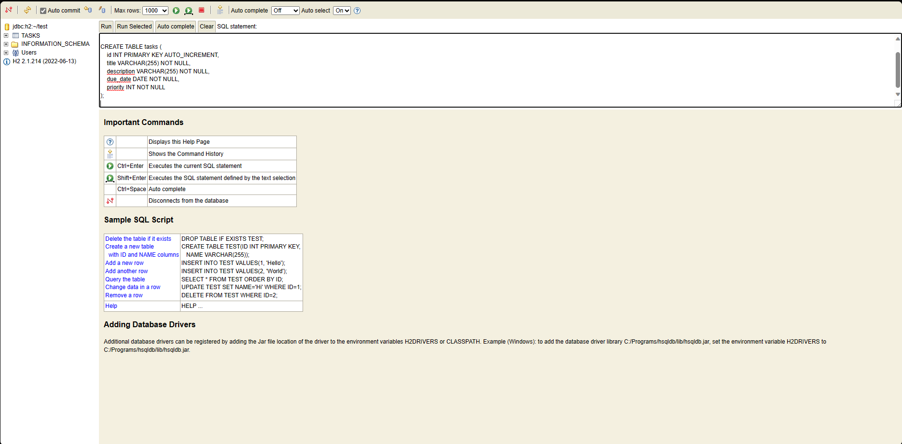

27/06/2023 - Inicio do projeto.

27/06/2023 - Idealização do projeto.

27/06/2023 - Criação do repositorio no GitHub: https://github.com/carllopessil/habitControl

Proximos passos:

1 - Mapear pré requisitos;

2 - Criar prototipo de alta fidelidade;

!!IMPORTANTE!!

!!!!Tutorial para criação de banco!!!!

Script para criação do banco, antes de usar acesse http://localhost:8080/console, 
preencha o como a imagem abaixo:

e no campo Password coloque "sa".

Após isso abrira a seguinte tela:

insira na caixa de texto que está em branco o seguinte texto:

DROP TABLE IF EXISTS tasks;

CREATE TABLE tasks (
id INT PRIMARY KEY AUTO_INCREMENT,
title VARCHAR(255) NOT NULL,
description VARCHAR(255) NOT NULL,
due_date DATE NOT NULL,
priority INT NOT NULL
);

como mostra a imagem abaixo:

Selecione run e pronto a aplicação está pronta para ser utilizada, acesse http://localhost:8080/ e faça bom proveito da aplicação!

Visão inicial da pagina principal do projeto: 