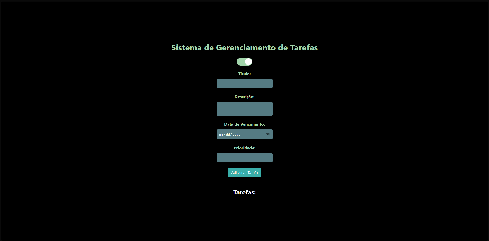
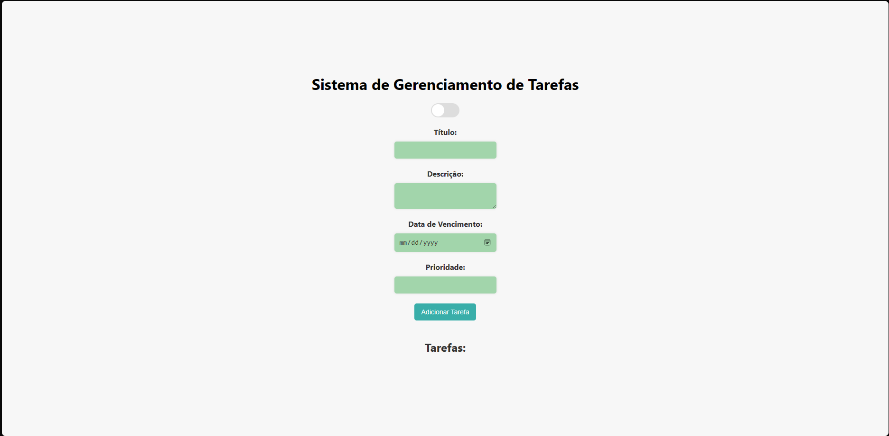

27/06/2023 - Inicio do projeto.

27/06/2023 - Idealização do projeto.

27/06/2023 - Criação do repositorio no GitHub: https://github.com/carllopessil/habitControl

Proximos passos:

1 - Mapear pré requisitos;

2 - Criar prototipo de alta fidelidade;

Visão inicial da pagina principal do projeto:

